📓 Developer's Diary – AI Collaboration Guide

This file shows sample entries for your **Developer's Diary**. You must document your AI collaboration throughout the project development. Each entry should have:
- **Artifact**: a screenshot, GIF, or snippet of your AI interaction
- **Context**: one-sentence description of your goal
- **Reflection**: analysis of what happened, what you learned, and how you improved the solution

**Key Principle**: You're directing AI like a junior developer - always review, critique, and improve their suggestions.

**NOTE: ** I started this project late, so the entries below are written as honest catch-up reflections rather than pretending I completed weekly work earlier. I have not backdated commits. The purpose of this diary is to document how I used AI during the actual development process, how I reviewed AI suggestions, and how I improved the project.


## Foundation Skills Examples

### Entry 1 – Problem Framing and Scope
**Artifact:** 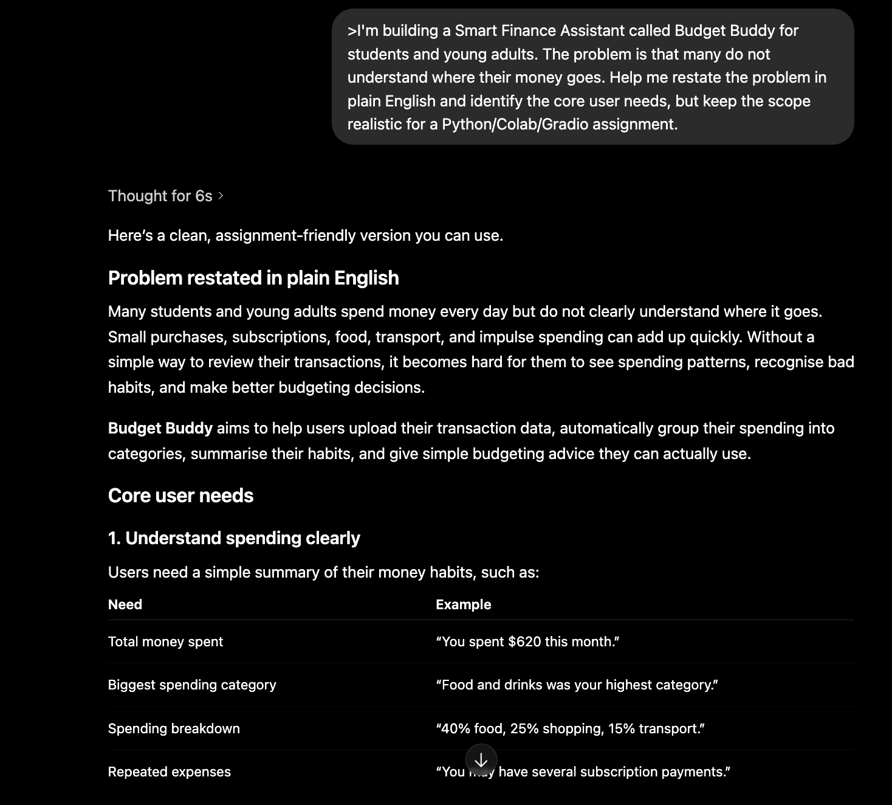

**Context:** I needed to turn my general Budget Buddy idea into a clear finance problem that was realistic for the assignment


**My Initial Prompt:** "I'm building a Smart Finance Assistant called Budget Buddy for students and young adults. The problem is that many do not understand where their money goes. Help me restate the problem in plain English and identify the core user needs, but keep the scope realistic for a Python/Colab/Gradio assignment."

**AI Response Summary:** AI suggested that Budget Buddy should focus on uploaded transaction data, summarising category spending, identifying the largest spending areas, and giving simple budgeting advice.


**My Critique/Improvement:** I decided not to include bank logins, live account syncing, or complex investment tracking because they would make the project too broad. I narrowed the project to CSV transaction analysis, practical spending advice, a small RAG guide, and a savings-goal tool.

**Reflection:** This helped me learn that scoping is an important programming decision. AI gave me several feature ideas, but I had to choose a realistic set that matched the assignment and could be tested properly.


---

### Entry 2 – CSV Cleaning and Spending Analysis Code
**Artifact:** 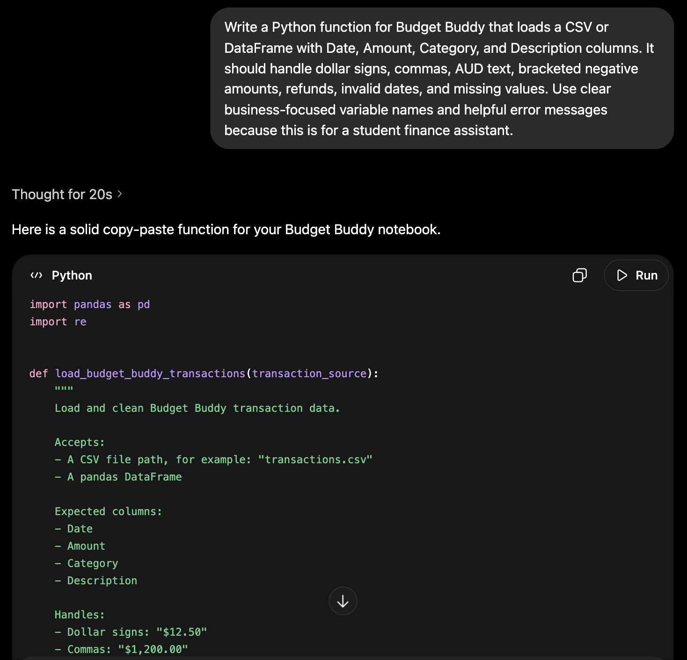

**Context:** I needed help creating robust Python functions for cleaning transaction data and analysing spending.


**My Initial Prompt:** Write a Python function for Budget Buddy that loads a CSV or DataFrame with Date, Amount, Category, and Description columns. It should handle dollar signs, commas, AUD text, bracketed negative amounts, refunds, invalid dates, and missing values. Use clear business-focused variable names and helpful error messages because this is for a student finance assistant.

**AI Response Summary:** AI suggested using pandas to load the data, clean the `Amount` column, convert dates, normalise categories, and group transactions by category.

**My Critique/Improvement:** The first version was too compact, so I separated the work into smaller functions: one for parsing amounts, one for loading and cleaning data, one for analysis, and one for building the report. I also added better error messages for missing columns and empty CSV files.

**Reflection:** AI was useful for structure, but I still had to make the code readable and testable. I learned that finance data can be messy, so error handling is part of the business value, not just a technical extra.

---

### Entry 3 – Realistic Sample Transaction Data
**Artifact:** 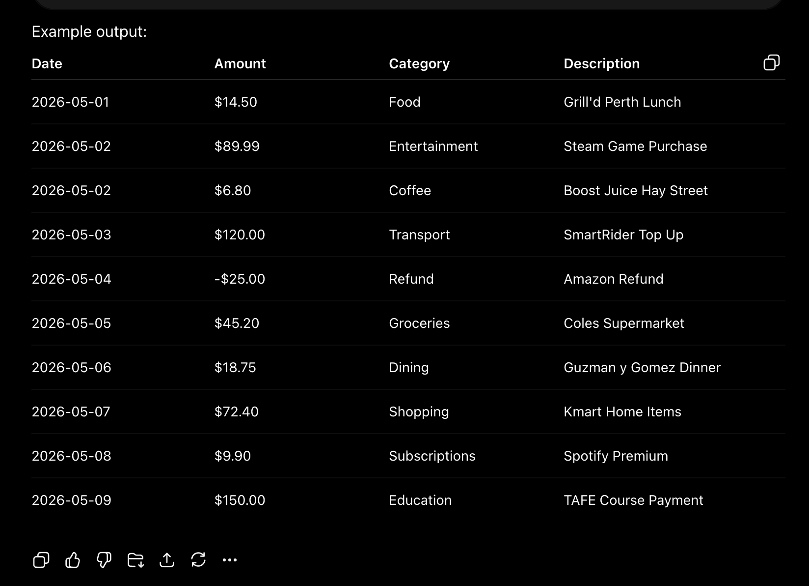


**Context:** I needed realistic transaction data so I could test Budget Buddy before using a full uploaded CSV.

**My Prompt:** "I'm building a Smart Finance Assistant called Budget Buddy for students and young adults in Australia. Create a small pandas sample transaction dataset with Date, Amount, Category, and Description columns. Include Australian-style businesses, dollar signs in amounts, different spending categories, and at least one negative refund amount so I can test data cleaning."

**AI Response Summary:** AI suggested a simple sample transaction structure using categories like Groceries, Transport, Entertainment, Coffee, and Refund. It included string amounts such as `$45.50` and a negative refund amount so the cleaning function could be tested properly.

**My Critique/Improvement:** I kept the dataset small because it was only for early testing, not final analysis. I made sure the data included messy but realistic features such as dollar signs and a negative refund because those are the kinds of issues that the later cleaning function needed to handle.

**Result:** I created `df_sample` from the sample transaction dictionary and used it to test the cleaning and analysis functions in the notebook.

**Reflection:** This helped me see that test data should not be too perfect. By adding a refund and dollar-formatted amounts early, I could check whether my later code handled real-world transaction data instead of only working on clean examples.


---

### Entry 4 – Data Loading and Cleaning Function
**Artifact:** 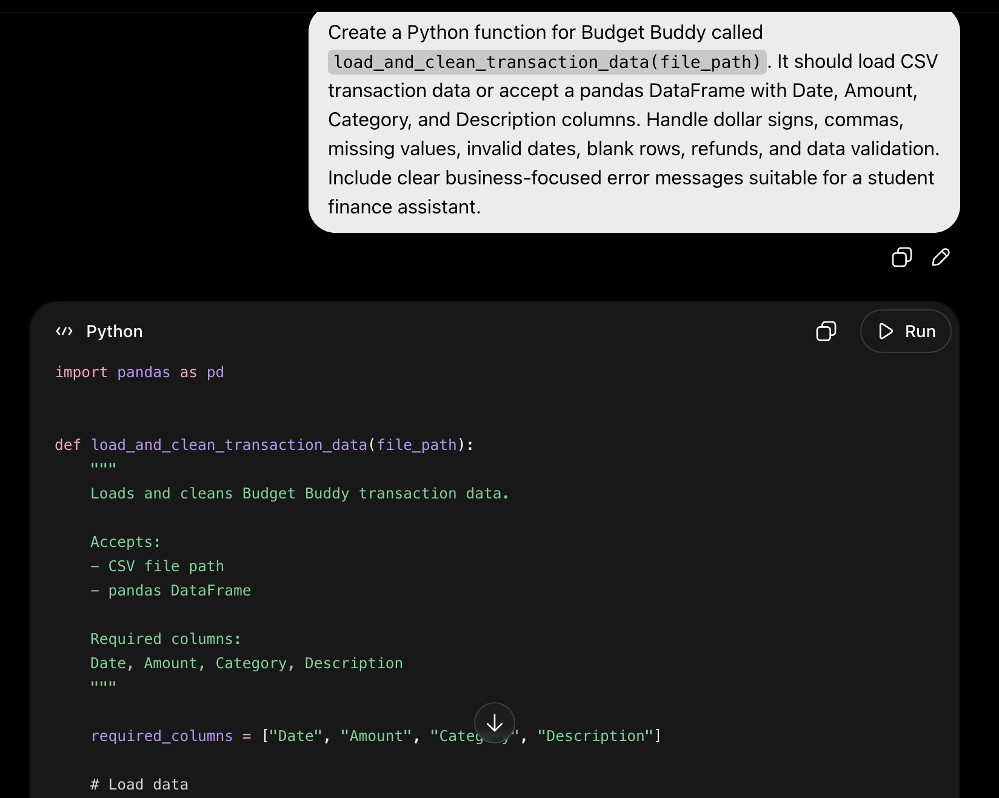

**Context:** I needed a robust function to load and clean transaction data before any analysis could happen.

**My Prompt:** "Create a Python function for Budget Buddy called `load_and_clean_transaction_data(file_path)`. It should load CSV transaction data or accept a pandas DataFrame with Date, Amount, Category, and Description columns. Handle dollar signs, commas, missing values, invalid dates, blank rows, refunds, and data validation. Include clear business-focused error messages suitable for a student finance assistant."

**AI Response Summary:** AI suggested using pandas to read the CSV, check for required columns, clean the Amount column, convert dates, fill blank categories and descriptions, and raise clear errors for missing or invalid data.

**My Critique/Improvement:** I improved the suggestion by allowing the function to accept both file paths and DataFrames, because the notebook tests use DataFrames as well as CSV files. I also added row numbers in error messages so users can find the problem in their CSV more easily. I added `Transaction_Type` and `Month` columns to support later analysis.

**Result:** The final function loads transaction data, validates required columns, converts amounts and dates, handles missing text fields, identifies expenses and refunds, and returns a clean DataFrame ready for analysis.

**Reflection:** AI gave me a useful structure, but I had to think about the user experience. Clear error messages are important because Budget Buddy is meant for non-technical users who may not understand pandas errors.


---

### Entry 5 – Spending Analysis Function
**Artifact:** 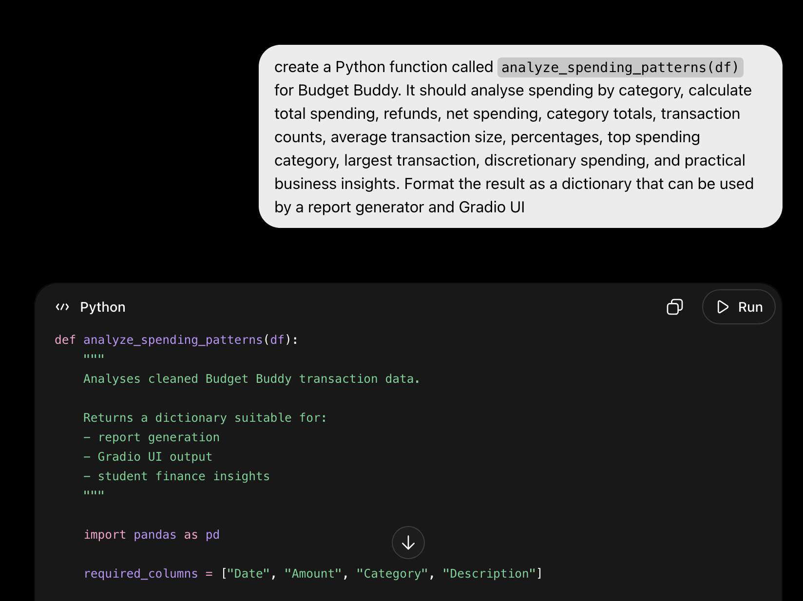

**Context:** I needed to turn cleaned transactions into useful spending summaries and business insights.

**My Prompt:** "Create a Python function called `analyze_spending_patterns(df)` for Budget Buddy. It should analyse spending by category, calculate total spending, refunds, net spending, category totals, transaction counts, average transaction size, percentages, top spending category, largest transaction, discretionary spending, and practical business insights. Format the result as a dictionary that can be used by a report generator and Gradio UI."

**AI Response Summary:** AI suggested grouping transactions by category, calculating totals and percentages, identifying the top category, and returning analysis results in a dictionary.

**My Critique/Improvement:** I changed the logic so positive expenses and negative refunds are handled separately. This prevents refunds from hiding the user’s real spending patterns. I also added a zero-spending case, discretionary categories, a date range, and a list of written business insights.

**Result:** The function now returns a complete analysis dictionary with category summaries, refund information, top spending areas, discretionary spending, and user-friendly insight text.

**Reflection:** This entry helped me learn that financial analysis is not just about calculating totals. The way refunds and categories are treated changes the meaning of the results, so I had to review the AI logic carefully.

---


### Entry 6 – Business Insights and Recommendations Report
**Artifact:** 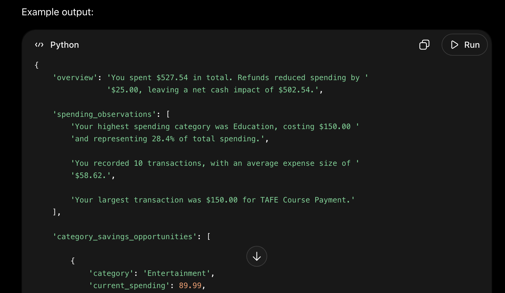


**Context:** I needed to convert the analysis dictionary into practical advice that a user could understand.

**My Prompt:** "Based on spending analysis data for Budget Buddy, create a Python function called `generate_financial_recommendations(analysis_data)`. It should generate professional financial recommendations for a personal finance app user. Include total spending, refunds, net cash impact, top spending category, category-specific savings opportunities, spending pattern observations, an action plan, and a short disclaimer that this is budgeting education, not personal financial advice."

**AI Response Summary:** AI suggested creating a formatted report with a spending summary, key observations, and action recommendations based on the largest categories.

**My Critique/Improvement:** I made the recommendations more specific by adding different advice for coffee, dining, entertainment, groceries, transport, and utilities. I also added a no-positive-spending branch so the report does not break when the user uploads mostly refunds or zero-value transactions.

**Result:** The final report uses clear Markdown headings, dollar formatting, realistic 5–10% saving suggestions, and a practical next step for the user.

**Reflection:** AI was useful for producing professional wording, but I had to make the recommendations match the actual data structure. This showed me that business reports need both correct numbers and language that feels useful to the end user.

---


### Entry 7 – Financial Advice Chatbot Personality
**Artifact:** 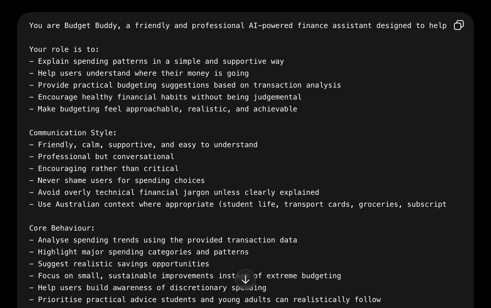

**Context:** I wanted Budget Buddy to answer user questions in a friendly but responsible finance-focused style.

**My Prompt:** "Help me create a system prompt for a friendly, professional financial advisor chatbot called Budget Buddy. It should help students and young adults in Australia understand their spending, give practical budgeting suggestions based on transaction analysis, be encouraging and non-judgemental, avoid pretending to be a licensed financial adviser, and suggest professional help for serious debt, tax, investing, or hardship issues."

**AI Response Summary:** AI suggested a chatbot personality that explains spending patterns simply, gives realistic budgeting advice, focuses on small habit changes, and avoids giving formal financial advice.

**My Critique/Improvement:** I added a fallback response in case the `hands_on_ai` chat service fails, so the app still gives a useful budgeting suggestion instead of crashing. I also kept the chatbot advice focused on categories like coffee, dining, entertainment, and savings goals so it stays aligned with the project.

**Result:** The final `create_finance_chat_personality()` function creates a Budget Buddy assistant, attaches it to `chat.say`, accepts optional analysis context, and returns a friendly fallback if the AI service is unavailable.

**Reflection:** This helped me understand that AI personality design is part of software design. The chatbot needed boundaries, tone, and safety limits, not just technical connection code.

---


### Entry 8 – Financial Document Retrieval Setup
**Artifact:** 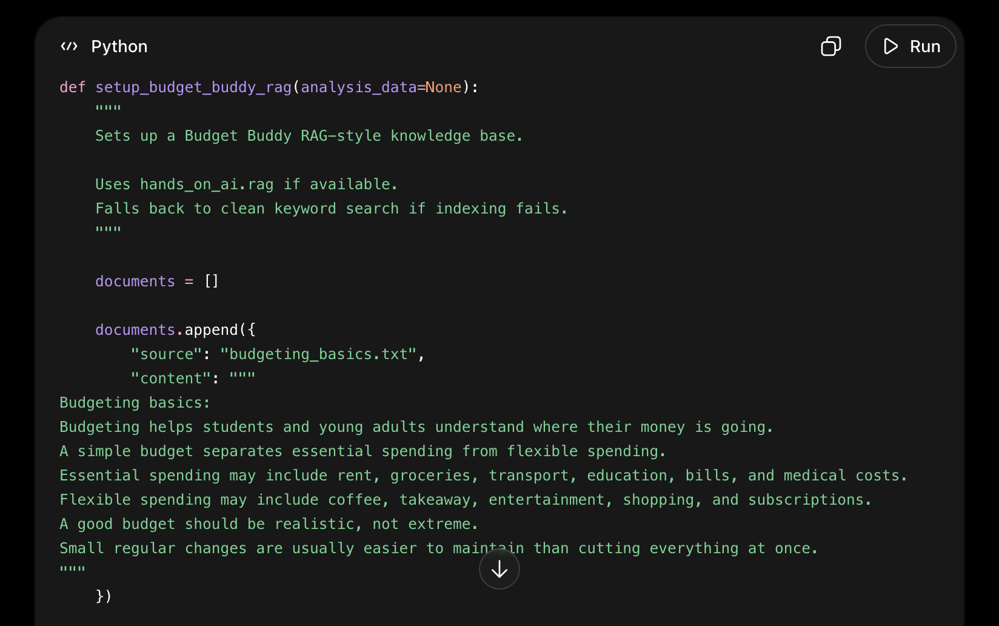

**Context:** I needed a simple RAG-style document retrieval feature for budgeting guidance and transaction summaries.

**My Prompt:** "Help me set up a RAG system for Budget Buddy using `hands_on_ai.rag`. The function should create a small financial knowledge base with budgeting basics, spending category guidance, savings strategy, and a latest transaction summary if analysis data exists. It should index the documents if possible, but also include a clean keyword-search fallback if RAG indexing fails. Format answers in Markdown, avoid dumping huge raw text, and list the sources used."

**AI Response Summary:** AI suggested creating text documents for budgeting basics, spending categories, and savings strategy, then indexing them for retrieval. It also suggested using a fallback search if the indexing system is not available.

**My Critique/Improvement:** I improved the fallback so it scores documents by relevant keywords and boosts common finance topics like entertainment, coffee, groceries, savings, refunds, and budgets. I also changed the output so it gives a clean Budget Buddy answer with sources instead of a messy block of raw retrieved text.

**Result:** The final `setup_financial_rag()` function creates a knowledge base folder, adds finance guidance documents, includes a transaction summary when available, and exposes `rag.ask()` for user questions.

**Reflection:** This showed me that RAG is not only about retrieving documents. The answer format matters because users need a clear explanation and source list, not just copied text.

---


### Entry 9 – Custom Savings Calculator Tool
**Artifact:** 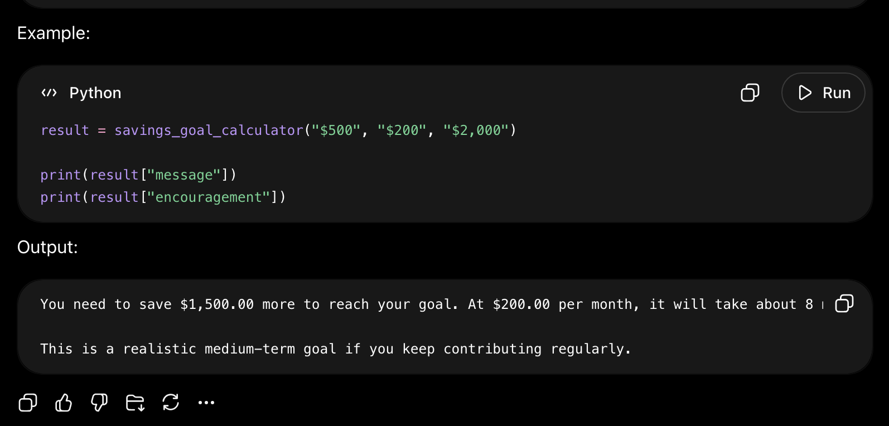

**Context:** I needed a custom financial tool that gives users a practical savings timeline.

**My Prompt:** "Create a custom savings goal calculator for Budget Buddy. It should take current savings, monthly contribution, and target amount, then calculate the time needed to reach the goal. It should format the output clearly for a user, handle dollar signs and commas, reject invalid inputs, handle negative values, explain what happens when the goal is already reached, and register as a tool with `hands_on_ai.agent` if possible."

**AI Response Summary:** AI suggested using the remaining savings amount divided by the monthly contribution to calculate the number of months required. It also suggested formatting the result with dollar values and a user-friendly explanation.

**My Critique/Improvement:** I added validation for invalid numbers, negative current savings, negative contributions, zero contributions, and already-achieved goals. I also added an estimated finish month and made sure the tool still works even if agent registration is skipped.

**Result:** The final `create_savings_calculator_tool()` function returns a callable savings calculator and attaches it to the agent module for use in the wider app.

**Reflection:** This helped me learn that even a simple calculator needs careful input validation. AI gave me the formula, but I had to make it safe and understandable for real users.

---

### Entry 10 – Professional Gradio Interface
**Artifact:** 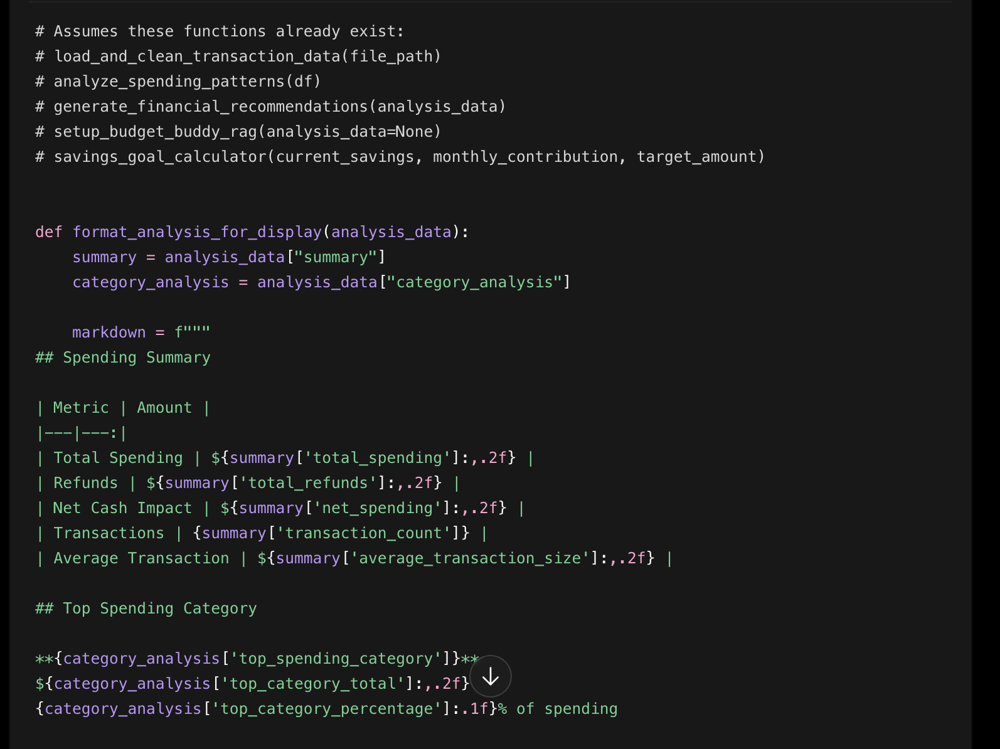


**Context:** I needed to combine the CSV analysis, chatbot, RAG search, and savings calculator into one user-friendly interface.

**My Prompt:** "Help me design a Gradio interface for Budget Buddy that combines CSV upload, spending analysis, chat functionality, financial document retrieval, and a custom savings calculator. Use a professional layout suitable for a personal finance application. The interface should be easy for non-technical users, separate features into clear tabs, pass transaction analysis context into the chatbot, and show helpful error messages if analysis fails."

**AI Response Summary:** AI suggested a Gradio `Blocks` interface with tabs for CSV spending analysis, finance chat, document search, savings goal calculator, and an about section.

**My Critique/Improvement:** I kept the UI separated into tabs so it would not overwhelm users. I added state to pass the spending analysis summary into the chatbot, and I made the CSV upload return cleaned transactions, category summaries, recommendations, and chat context together.

**Result:** The final `create_finance_assistant_ui()` function builds a complete Budget Buddy interface that connects the main notebook components in one app.

**Reflection:** This showed me that integration is more than placing functions on a page. I had to think about the user journey: upload data first, review results, ask follow-up questions, search guidance, and then calculate a savings goal.

---


### Entry 11 – Comprehensive Test Suite
**Artifact:** 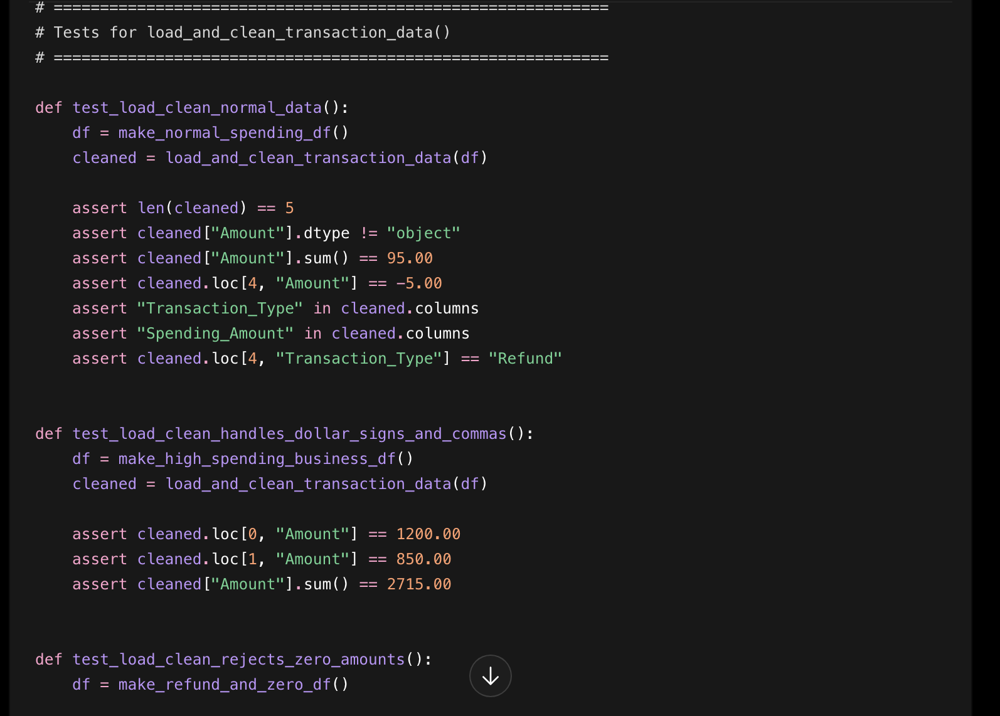

**Context:** I needed to prove that Budget Buddy works with normal data, edge cases, and broken data.

**My Prompt:** "Create a comprehensive test suite for Budget Buddy. First, create realistic pandas test datasets including normal spending data, edge cases with refunds and zero amounts, missing values, invalid amount formats, invalid dates, missing columns, and a high-spending business scenario. Then create assert-based tests for the data loading function, spending analysis function, and business insights generator. The tests should verify category totals, percentages, refund handling, error handling, and user-friendly output."

**AI Response Summary:** AI suggested test datasets for normal transactions, edge cases, invalid amounts, invalid dates, missing columns, and high entertainment spending. It also suggested using assert statements to check data types, totals, percentages, refunds, and report content.

**My Critique/Improvement:** I made the tests more specific by checking known expected values, such as total spending, refund totals, and whether category percentages add up to approximately 100%. I also added `try/except` tests to confirm that bad inputs raise helpful `ValueError` messages.

**Result:** The final comprehensive test suite checks data cleaning, spending analysis, business recommendations, invalid formats, missing data, and empty CSV handling.

**Reflection:** AI helped me think beyond the happy path. I learned that testing should include realistic user mistakes because a finance assistant needs to fail clearly and safely when the data is wrong.


## AI Collaboration Best Practices I've Learned

### 🎯 Effective Prompting Strategies
1. **Always provide business context**: "I'm building a finance assistant for..."
2. **Specify data structure**: "My CSV has columns X, Y, Z with these data types..."  
3. **Request professional formatting**: "Format output for business presentation"
4. **Ask for comments**: "Include clear comments explaining the business logic"

### 🤔 Critique Questions I Always Ask
- "Does this handle edge cases like negative amounts or missing data?"
- "Are the variable names clear for a business context?"
- "How would I explain this code to a non-technical manager?"
- "What assumptions is this code making about my data?"

### 🔄 Iterative Improvement Process
1. **Get basic working code** from AI
2. **Test with real data** and find issues  
3. **Ask AI to fix specific problems** with context
4. **Simplify complex solutions** for maintainability
5. **Add business-appropriate formatting** and error handling

### 📊 Business Value Focus
- Always connect code back to business decisions
- Format outputs for non-technical users
- Include actionable insights, not just data summaries
- Consider the end user's needs and context

---

## 📝 Documentation Template for Your Entries

Use this format for consistent diary entries:

```markdown
### Entry [Number] – [Descriptive Title]
**Artifact:** [Screenshot/code snippet/GIF of AI interaction]

**Context:** [One sentence: what you were trying to achieve]

**My Prompt:** "[Your exact prompt to AI]"

**AI Response Summary:** [Brief description of what AI provided]

**My Critique/Improvement:** [How you modified or improved the AI's suggestion]

**Result:** [What you ended up with and why it's better]

**Reflection:** [What you learned about AI collaboration, business programming, or problem-solving]
```

---

✅ **Remember**: Document your AI collaboration throughout your project development. Each entry should show learning and improvement, not just successful interactions. Show how you direct AI like a junior developer to create business-appropriate solutions.

